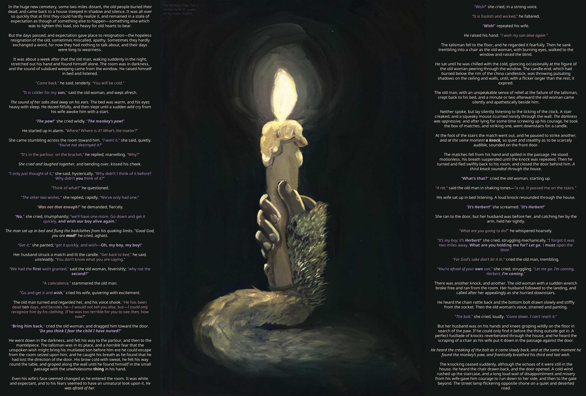
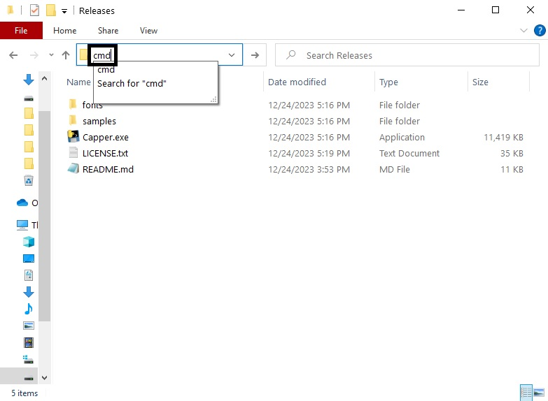
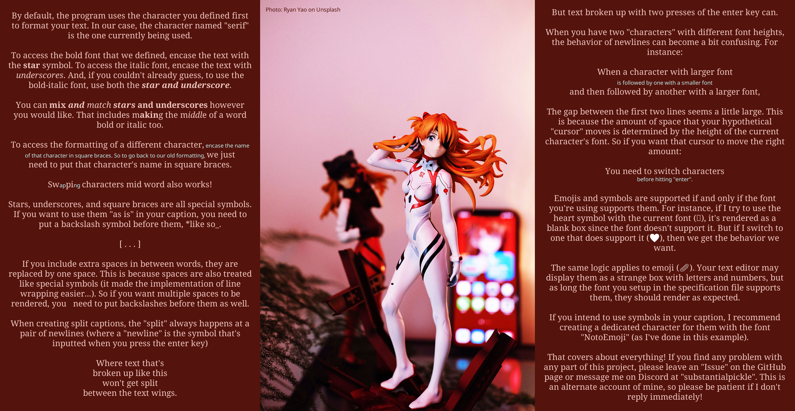

# Introducing Capper!



Welcome to Capper, where caption typesetting is made easy! Here's what you can do with this program:

* Automatically size and fit your text to an image based on its length.
* Customize the automatic fitting to your liking
* Use a simple markup format to blend together text with different sizes, fonts, symbols, and colors
* Output transparent rendered text images for further processing in an external image editor

See the [Usage](#usage) section for instructions on how to run the program, and the [Getting Started](#getting-started) section for a quickstart guide on making your first caption.

## Also check out [CapperGUI](https://github.com/synchroslap/CapperGUI) by synchroslap!
Capper is a terminal based application, making it potentially difficult to operate for some users. CapperGUI wraps a graphical interface around Capper for ease of use.

# Usage
If you're on Windows, download the latest release from the [Releases](https://github.com/substantialpickle/Capper/releases/tag/stable) page to get a precompiled executable with some samples. It's in the zip named `capper-windows-vX.X.X.zip` under the Assets dropdown. Open a terminal in the directory of the executable and run the following command.
```
Capper.exe <path/to/spec/file>
```

If you're not on Windows or would like to interpret the code directly: clone this repository, download the required packages in `requirements.txt`, and run the program through Python.
```
git clone https://github.com/substantialpickle/Capper/
cd Capper
pip install -r requirements.txt
python capper/caption.py <path/to/spec/file>
```

If you'd like to compile an executable yourself, use Pyinstaller.
```
git clone https://github.com/substantialpickle/Capper/
cd Capper
pip install -r requirements.txt
python -m pyinstall capper/caption.py --onefile
```

# Getting Started
To make a caption with this program, you'll generally need to provide at least four key files.

* A font in the `.ttf` format
* An image file that your text will be placed beside
* A plain `.txt` file containing the text of your caption
* A `.toml` specification file (don't let the extension scare you, just treat it like a plain text file)

This guide will give you a basic overview of how to write a simple specification, format your text, and execute the program to generate a caption.

## The Specification
The `.toml` file serves as the glue that binds all elements of your caption. It tells the program where to locate the art, text, and fonts for your caption. It also defines details like text color, placement, line spacing, and more. This section will guide you through assembling a "bare-minimum" specification to help you get started.

Create and open a new file named `spec.toml` in the same folder as the executable, or reference the file in `samples/getting-started/spec.toml`.

There are at least four sections you need to define for a valid specification: `[image]`, `[text]`,  `[output]`,  and one or more `[[characters]]`.

### The `[image]` Section
In `spec.toml`, copy in the following text.
```toml
[image]
art = "samples/getting-started/img.jpg"
bg_color = "#54130C"
```
Text in square braces defines a new section. Here, we're defining a new section named `image`. In it, we have two keys-value pairs: `art` and `bg_color`.

`art` is set to the path of the image we want to use for our caption. I've set it sample image I've provided in the download. `bg_color` is an RGB code for the background color that will be behind our text. I've set it to a dark red.

Note the quotes in between the values of each key-value pair. In valid `.toml` file, any value that isn't a number must be surrounded in quotes. You may run into some strange errors if you forget to do this.

### The `[text]` Section
In `spec.toml`, copy in the following text.
```toml
[text]
text = "samples/getting-started/text.txt"
text_box_pos = "split"
```
`text` is set to the path of the text file we want to use for our caption. We'll go over how exactly this is formatted later.  Be sure to replace the path with the one for your actual text file if you choose to follow along manually.

`text_box_pos` tells the program how to position the text relative to the image. It can be `left`, `right`, or as I've done it here, `split` (so that the text is "two-winged", with half of it to the left, and the other half to the right).

### The `[output]` Section
In `spec.toml`, copy in the following text, and make a new folder called `outputs` in the same folder the executable is in.
```toml
[output]
base_filename = "test"
output_directory = "outputs"
outputs = ["caption", "autospec"]
```
`base_filename` is the text that every filename the program generates will be prefixed with. For example, running the program with this specification will generate an image named `test_cap.png`. `output_directory` is the directory that all generated files will be placed in.

`outputs` is set to a list that specifies what files should be generated when the program finishes. `"caption"` indicates that we want to generate an image that contains our formatted text combined with the art. `"autospec"` is explained in the later section [Looking at the Outputs](#looking-at-the-outputs).

### The `[[characters]]` Section(s)
In `spec.toml`, copy in the following text.
```toml
[[characters]]
name = "serif"
color = "#F0C7C2"
font = "fonts/Noto_Serif/NotoSerif-Regular.ttf"
```
This section is used to define the "characters" of your story. More literally, they define how certain groups of text should be formatted, what tag (or "name") those groups should be identified with, and what font to use. The way we access these "characters" in the text will be covered in the next section.

Note how we didn't specify a bold or italic font. These get autoselected by the program based on the filename of other fonts in the `fonts/Noto_Serif/` directory.

Also note the double square braces (`[[]]`) that surround the header name. The `character` header is special since we want more than one of them; the double square braces is what lets us do that in `toml`. In fact, let's try it out. Copy in the following text and save the file.

```toml
[[characters]]
name = "sans"
color = "#C2EFF0"
relative_height = 0.7
font = "fonts/Noto_Sans/NotoSans-Regular.ttf"

[[characters]]
name = "em"
color = "#FFFFFF"
font = "fonts/Noto_Emoji/NotoEmoji-Regular.ttf"
```
There are many more options you can play with, which I cover briefly towards the end of this guide and in more detail on the [wiki](https://github.com/substantialpickle/Capper/wiki/Specification-Guide). But for now, this is all you need for a specification!

## The Text File
This file is where the main text of your caption lives, plus some minimal formatting to access the "characters" we defined earlier.

I've written up a sample text file that explains the markup format and some of it's quirks. Read the file `samples/getting-started/text.txt` (from the download or [via GitHub](https://github.com/substantialpickle/Capper/blob/main/samples/getting-started/text.txt)).

## Putting it All Together
Now that we have all the files we need, the only thing left is to put them all together with the executable. This guide assumes you're using the Windows `.exe` from the Releases section. If you want to run the program with a Python interpreter, replace `Capper.exe` with `python capper/caption.py` in the sample commands.

### Running the Program
`Capper.exe` is a console application, meaning that you have to type a command into a terminal or command prompt to run it. On Windows, the easiest way to do this is to navigate to the folder with `Capper.exe`, type `cmd` in the path bar, and press enter.



In the terminal, copy in the following command and press enter.
```
C:\...\Capper> Capper.exe spec.toml -o
```
Or if you want to use the provided sample directly, do:
```
C:\...\Capper> Capper.exe samples/getting-started/spec.toml -o
```
In general, the form of the command is:
```
C:\...\Capper> Capper.exe <path/to/specifcation/file> -o
```
The `-o` at the end tells the program to open the caption with your default image viewer after it's generated.

### Looking at the Outputs



In the folder named `outputs` you made earlier, you should find two new files. One is named `test_cap.png`, which contains your generated caption. Another is named `test_autospec.toml`, which is a specification similar to one we put together originally, but with a lot of extra lines starting with the `#` symbol.

These new lines are comments that contain automatically selected values for the keys you didn't specify.

In general, the automatic values produce a fairly decent output, but sometimes, you may want to tune up some of them to your liking. Perhaps the line spacing needs to be a little larger, or maybe the image should be a bit taller. This file gives you an easy way to modify those number, either by uncommenting lines from the `autospec`, or copying them into your original specification.

Play around with these however you'd like! Read the [wiki](https://github.com/substantialpickle/Capper/wiki/Specification-Guide) for what the allowed values are, what they mean, and which ones are required.

If you want to access the values in the autospec, but don't want to deal with extra files being generated, you can have them outputted directly on the terminal by passing the `-s` option to the program.
```
C:\...\Capper> Capper.exe <path/to/specifcation/file> -s
```

### Transparent Backgrounds
Transparent background are supported for writers that want to do post-processing after generating their caption, such as adding their own background or applying a drop shadow on their text.

The background color in the specification file may be in either the RGB or RGBA hex format (The "A" in RGBA is short for alpha, a.k.a. transparency). To get a fully transparent background, use any RGBA 8-digit color whose last two digits are "00".
```toml
[image]
# ...
bg_color = "#00000000"
```

When doing custom work like this, it may be convenient to get the rendered text as a separate file from the combined caption. Specify `text` under `[output]` to do this.
```toml
[output]
# ...
outputs = ["text"]
```

## Closing Notes
That's all! I really hope you find this program useful. It's something that I started on a whim and have put a lot of hours into. I have a good amount of experience typesetting captions manually, and I've done my best to capture all the things I've learned intuitively into this program into something that's (hopefully...) easy to use.

Along with the [wiki](https://github.com/substantialpickle/Capper/wiki/Specification-Guide) for the `.toml` specification, I've also written some [tips and tricks](https://github.com/substantialpickle/Capper/wiki/Tips-and-Tricks) that I've picked up while "playtesting".

If you find any problem with any part of this project, please leave an "Issue" on the GitHub page or message me on Discord at "substantialpickle". This is an alternate account, so please be patient if I don't reply immediately!
